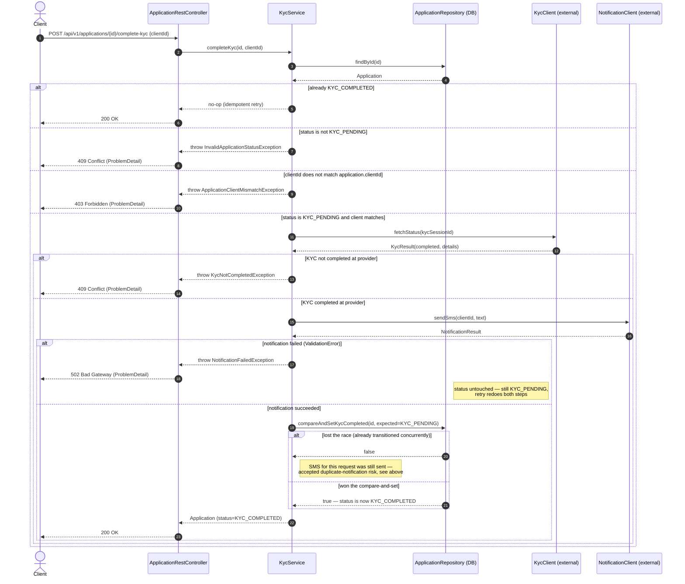

# Complete KYC — Flow

How `KycService.completeKyc(applicationId, clientId)` moves an `Application` from
`KYC_PENDING` to `KYC_COMPLETED` after confirming KYC status with the external provider
and notifying the client by SMS.

The SMS is sent **before** the status transition is committed, not after. Notification is
mandatory here — a failed send must surface as an error — so if the status were committed
first, a failed SMS would leave the application in `KYC_COMPLETED` already, and a client
retry would hit the idempotent no-op branch below and never re-attempt the SMS. Sending
first means a failed SMS leaves the application untouched at `KYC_PENDING`, so a retry
correctly redoes both steps.

One accepted trade-off from this ordering: unlike `LenderClient.blockLimit` in
`lending-application-service` (which takes a deterministic `requestId`),
`NotificationClient.sendSms` has no idempotency key. Two genuinely concurrent calls for
the same application could both pass the status check and both send an SMS before only
one of them wins the `compareAndSet` below. This is a narrow race, and unlike a duplicate
lender-limit block, the cost of hitting it is a duplicate text message, not duplicated
money — so it's accepted rather than closed with an extra claim-state machine.

`ApplicationNotFoundException` (application id doesn't exist) follows the same shape as
the other error branches: thrown by `KycService`, mapped by `ApplicationExceptionHandler`
to `404 Not Found`. Omitted from the diagram above only because it short-circuits before
any branch shown — it's the very first thing checked after `findById`.
