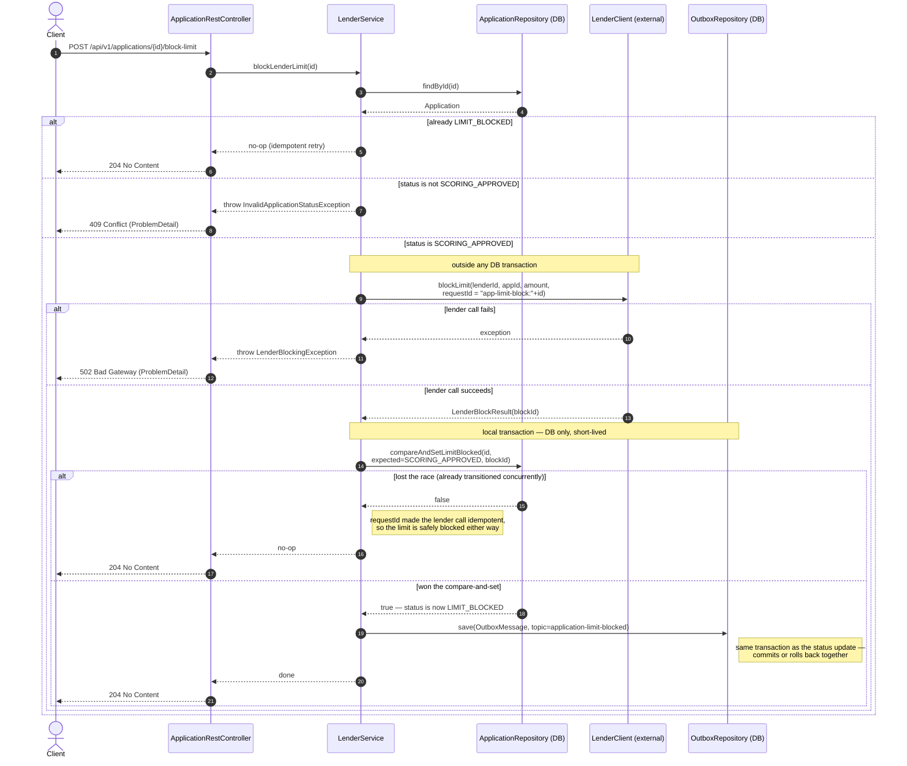
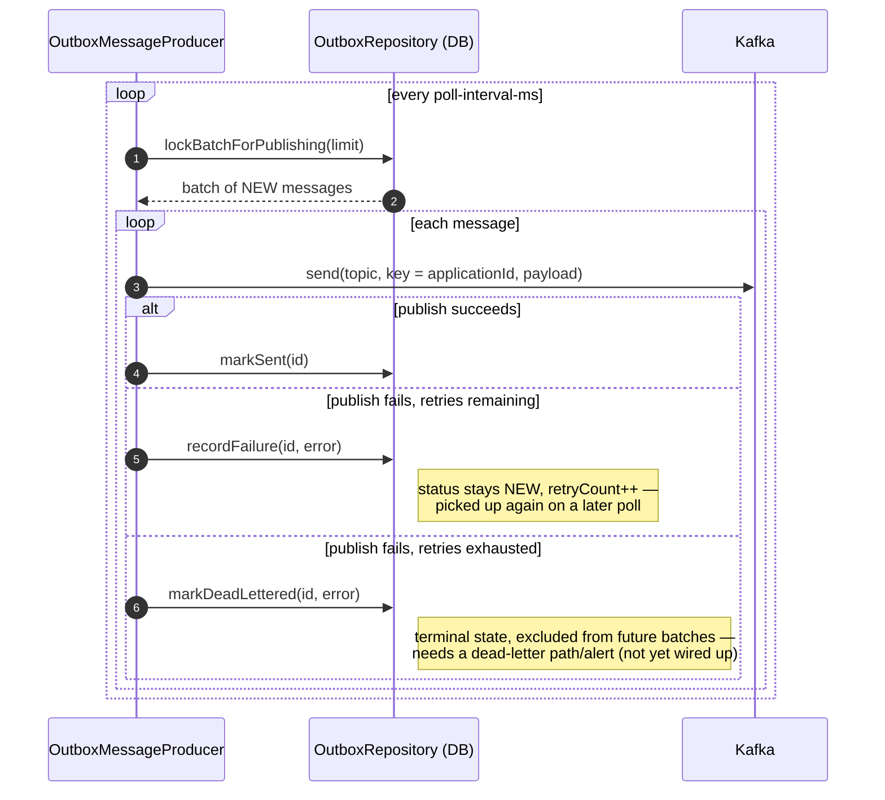

# Block Lender Limit — Flow

How `LenderService.blockLenderLimit(id)` moves an `Application` from `SCORING_APPROVED`
to `LIMIT_BLOCKED`, and how the resulting `ApplicationLimitBlocked` event reaches Kafka
via the transactional outbox.

Two things are deliberately decoupled here:

- The call to the **external lender** happens outside any DB transaction — it's slow and
  unreliable, and a DB transaction should only ever wrap fast local work.
- **Publishing to Kafka** happens outside the request entirely. The request only writes a
  row to the outbox table, in the same local transaction as the status update. A separate
  poller (`OutboxMessageProducer`) relays outbox rows to Kafka on its own schedule. This is
  what avoids the dual-write problem: a single DB commit is atomic, a DB commit plus a
  Kafka publish is not.

`ApplicationNotFoundException` (application id doesn't exist) follows the same shape as the
other error branches: thrown by `LenderService`, mapped by `ApplicationExceptionHandler` to
`404 Not Found`. Omitted from the diagram above only because it short-circuits before any
branch shown — it's the very first thing checked after `findById`.

## Outbox relay (async, decoupled)

Runs independently of the request above — on its own schedule, potentially on a different
service instance. `lockBatchForPublishing` uses `SELECT ... FOR UPDATE SKIP LOCKED` so
multiple instances share the backlog instead of racing on the same rows.

Because delivery is at-least-once (a crash between `send` and `markSent` can redeliver),
consumers of `application-limit-blocked` must dedupe on `applicationId`.
