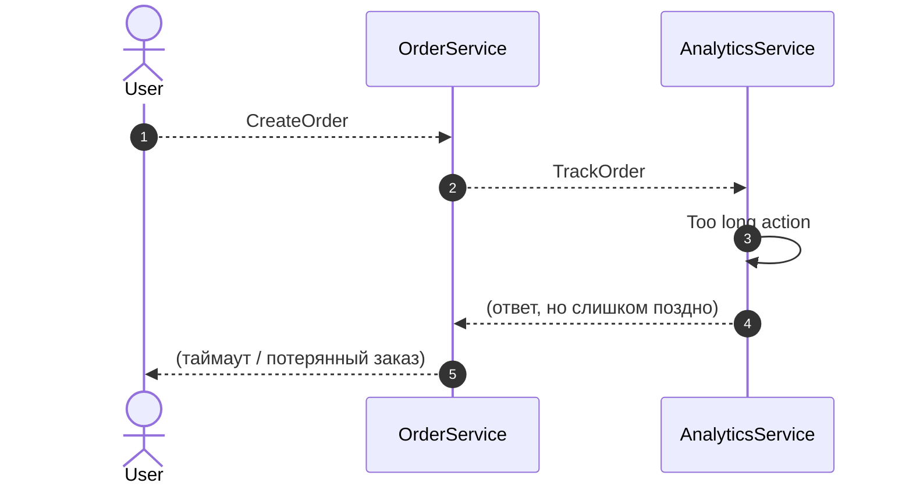
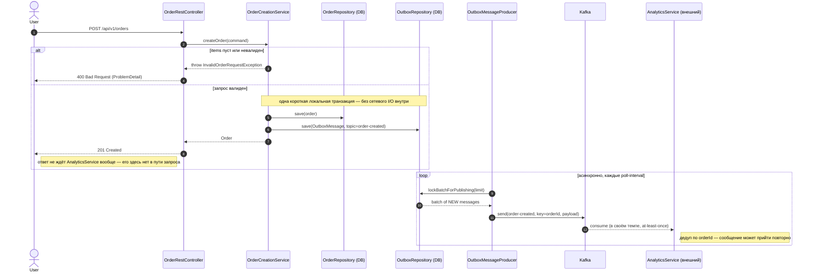

# Order Created — Flow

Отвечает на ТЗ "Асинхронное взаимодействие микросервисов": как перестать терять заказы и
деньги из-за того, что `AnalyticsService` периодически тормозит/таймаутит.

## Было (проблема из ТЗ)

`OrderService` синхронно вызывает `AnalyticsService.TrackOrder` внутри пути обработки
запроса и ждёт ответа, прежде чем ответить пользователю. Когда `AnalyticsService` подвисает
("Too long action"), `OrderService` не успевает ответить вовремя — клиент/gateway обрывает
соединение, и заказ (а с ним деньги) теряется, хотя с самим заказом всё было в порядке.

## Стало (это реализация в этом модуле)

`OrderService` в одной локальной транзакции сохраняет заказ и пишет строку в transactional
outbox, затем сразу отвечает пользователю — без единого сетевого вызова к `AnalyticsService`
в этом пути. Отдельный асинхронный поллер (`OutboxMessageProducer`, тот же паттерн, что в
`lending-application-service`) релеит событие `OrderCreatedEvent` в Kafka-топик
`order-created`; `AnalyticsService` (внешняя система, вне этого репозитория) вычитывает его
в своём темпе, дедуплицируя по `orderId`, поскольку доставка at-least-once.

Если `AnalyticsService` временами тормозит или вообще ненадолго лежит — событие просто
дольше лежит в outbox/Kafka и будет обработано позже; ответ пользователю на создание заказа
это никак не задерживает и не блокирует. `OutboxMessageProducer` уже умеет ретраить с backoff
и переводить в dead-letter после исчерпания попыток — то же самое поведение, что и в
`lending-application-service` (см. его `docs/block-lender-limit-flow.md`), логика не менялась.
